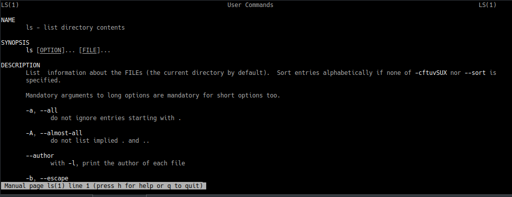

Assalamulaikum, saya ingin membagikan beberapa perintah dasar linux yang nantinya akan sedikit berguna ketika sobat menggunakan linux dengan *command line interface (CLI)*.

Perintah linux *case sensitive* dengan penggunaan *lowercase*, perintah linux tidak menggunakan huruf dengan uppercase, oleh karena itu ketika menulis perintah dengan dengan akan tetapi dengan uppercase tetap dianggap sebagai salah ketik oleh linux dan *command not found*.

### ls
Perintah yang pertama ialah **ls**, **ls** merupakan akronim dari *list* yang berisikan direktori ataupun berkas file yang berada pada direktori yang aktif.

Gambar 1. Perintah ls

Pada gambar 1 merupakan perintah ls beserta hasil keluaran dari perintah yang digunakan.

### man
Perintah yang selanjut yaitu ***man***, man merupakan akronim dari *manual* yang berfungsi sebagai manual book atau buku panduan, tata cara penggunaan perintah ataupun informasi terkait suatu perintah linux.

Gambar 2. penggunaan perintah man

Pada gambar 2 merupakan cara menggunakan perintah man, dengan cara man spasi perintah linux yang digunakan.

Gambar 3.tampilan setelah menggunakan perintah *man ls*.

### mkdir
Perintah ***mkdir*** merupakan perintah yang digunakan untuk membuat direktori atau folder dari ejaan make directory.

Gambar 4.Perintah mkdir

Gambar 4 merupakan cara menggunakan perintah ***mkdir***, ***mkdir*** ditambah dengan nama folder yang akan dibuat. Gambar 4 saya menamai folder saya dengan *pengenalan-linux*.

### cd
cd atau *change directory* merupakan perintah yang digunakan untuk berpindah dari suatu direktori ke direktori yang lain. contoh cd pengenalan-linux, "pengenalan-linux" merupakan direktori tujuan berpindahnya direktori.

Gambar 5. Perintah cd.

pada gambar 5 merupakan perintah cd untuk berpindah ke folder lain.

### pwd
***pwd*** atau *print working directory* merupakan perintah yang digunakan untuk melihat atau mengetahui posisi direktori yang sedang aktif atau posisi direktori user berada.

Gambar 6. perintah pwd

hasil dari gambar diatas menujukkan user sedang berada pada direktori */tmp/pengenalan-linux*.

### touch
***touch*** merupakan perintah untuk membuat suatu file. Penggunaan ***touch*** dimulai dengan perintah touch spasi lalu diikuti dengan nama file yang akan dibuat. Contoh touch file.txt, file.txt merupakan nama file yang akan dibuat.

Gambar 7. Perintah touch

### nano
***nano*** merupakan teks editor seperti notepad pada windows akan tetapi nano teks editor berbasis CLI tanpa ada interaksi klik untuk menyimpan atau keluar ketika mengubah teks file. Contoh penggunaan nano yaitu dengan nano spasi diikuti dengan nama file yang akan diedit.

Gambar 8. Tampilan nano text editor

pada gambar 8 terlihat file.txt yang masih kosong tanpa ada isi didalamnya, selanjut akan saya edit agar ada isi teks didalamnya.

pada gambar diatas sudah ada isi dari teks yang akan disimpan, cara untuk menyimpan file menggunakan nano yaitu dengan ctrl+o, jika sudah tersimpan maka boleh keluar dari tampilan nano dengan ctrl+x.

gambar diatas merupakan konfirmasi file yang akan disimpan, tekan enter saja dan sudah tersimpan.

### cat
***cat*** merupakan perintah untuk melihat atau menampilkan pada terminal isi file, bisa file text ataupun file source code. Contoh penggunaan ***cat*** yaitu dengan cat lalu diikuti dengan nama file yang akan diliat.

gambar diatas merupakan contoh penggunaan perintah cat, contoh nama file yang saya tampilkan adalah file.txt.

### cp
***cp*** merupakan perintah linux yang digunakan untuk menduplikat suatu file ataupun direktori, ***cp*** merupakan akronim dari *copy*. Contoh penggunaan ***cp*** yaitu cp diikuti dengan nama file yang akan diduplikat
dan tujuan dari peletakan file duplikasi tersebut.

contoh penggunaan cp dengan tujuan direktori yang lain

gambar diatas jika kita menduplikat ke folder yang sama, hanya mengganti tujuan folder dengan nama file yang berbeda dari yang berada pada folder

### mv
***mv*** merupakan perintah linux untuk memindahkan atau *cut* file atau direktori, ***mv*** bisa juga untuk mengganti nama file. Contoh penggunaan mv spasi diikuti dengan tujuan folder atau nama file yang baru ketika ingin mengganti nama file.

penggunaan mv untuk memindahkan file.

gambar diatas merupakan penggunaan mv ketika me-*rename* file.

### rm
***rm*** merupakan perintah linux yang digunakan untuk menghapus file atau direktori, berasal dari bahasa inggris *remove*. Contoh penggunaan *rm* spasi diikuti dengan nama file atau direktori yang ingin dihapus.

Terimakasih sudah membaca sejauh ini, postingan ini hanya membahas beberapa perintah dasar linux yang mungkin sehari-hari digunakan.

