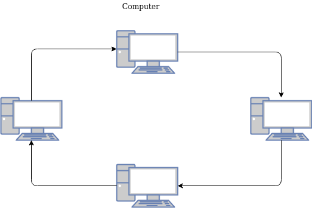

Halllooo, mungkin beberapa waktu kedepan saya akan lebih aktif menulis postingan terkait jaringan dan sistem operasi , karena sempat berfikir untuk menulis tentang pemrograman juga tapi lebih prioritas terhadap topik tentang jaringan komputer dan sistem operasi. Langsung saja terkait postingan ini, pasti sudah pada tahu karena dari judul postingan ini yang membahas tentang jaringan komputer.

### apasih yang dimaksud dengan jaringan komputer? atau apa itu jaringan komputer?
Jaringan komputer merupakan sistem yang terhubung dari beberapa komputer untuk berbagi informasi (data) dan sumber daya. Komputer dan beberapa perangkat memungkinkan berkomunikasi dengan lebih mudah menggunakan kabel ataupun nirkabel. Perangkat keras ataupun perangkat lunak digunakan dengan terhubung ke komputer dengan alat apapun. Jaringan komputer memiliki variasi tipe seperti server, personal computer (PC).

Tipe configurasi jaringan terdapat dua jenis, peer-to-peer dan client-server. Client server merupakan tipe yang paling sering dijumpai ketika kita berada diinternet dengan mengunduh file ataupun gambar. Konfigurasi yang terpusat oleh 'Server' dan pada sisi pengguna sebagai 'client', cocok untuk data penyimpanan dengan sisi server yang memiliki kualitas performa yang lebih baik dibandingkan dengan client. Contoh ilutrasi pada gambar dibawah ini:

  

Sedangkan peer-to-peer merupakan koneksi komputer yang bertindak sebagai server sekaligus client. Contoh ilustrasi seperti gambar dibawah ini:

  

### Bagaimana jaringan komputer itu dibangun?
- Terdiri dari minimal dua komputer.
- Terhubung melalui kabel atau nirkabel.
- Perangkat antarmuka jaringan pada komputer disebut *network interface card* (NIC).
- Sebuah *switch* untuk pertukaran data.
- Sistem operasi jaringan.

### Tipe jaringan
Jaringan dapat dibagi dalam beberapa kelompok berdasarkan keadaan geografi antara lain:
- Local Area Network (LAN).
- Wide Area Network (WAN).
- Metropolitan Area Network (MAN).
- Wireless Networks.

#### Jaringan LAN 
LAN merupakan jaringan dengan skala kecil seperti pada ruangan pada gedung dengan skala medium satu kabel. Teknologi ini lebih murah dibandingkan dengan WAN atau yang lain karena jangkauan yang lebih kecil lalu dengan kecepatan yang lebih baik. Jaringan LAN memiliki kecepatan dari 10 mbps hingga 100 mbps dengan low delay dan sedikit error.

Beberapa topologi dalam jaringan, topologi merupakan struktur jaringan sebagaimana komponen saling terhubung satu sama lain.

Bus topology.  
Topologi yang semua perangkat komputer terhubung oleh satu kabel panjang yang dinamakan *backbone* (workstation dan servers). Topologi bus rawan akan terjadi kegagalan pengiriman ketika ada permasalahan pada kabel. Contoh ilustrasi pada gambar dibawah ini:

  

Ring topologi.\
Topologi Ring merupakan topologi yang membentuk lingkaran. Setiap perangkat terhubung satu dengan yang lain, melingkar seperti cincin hanya dengan satu arah saja. Setiap perangkat mengirimkan pesan dengan loop tak terhingga. Untuk menghindari kekurangan dari topologi BUS, topologi RING dibuat. RING juga termasuk model yang gagal, RING mengirim token dari *node* satu ke *node* yang lain. Contoh ilutrasi seperti gambar dibawah ini:

  

Star topology.\
topologi star merupakan bentuk dengan perangkat yang terpusat di tengah dengan kabel yang terhubung ke segala arah. Perangkat yang terhubung melalui kabel yang langsung terhubung ke perangkat yang terpusat seperti *hub* atau *switch*. Topologi star dapat digunakan secara bersarang atau *nested* dengan bentuk *tree* atau hierarki. Sinyal elektromagnetik pada topologi star dikirim dari switch lalu disalurkan ke perangkat yang terhubung oleh switch. Topologi star bisa dikatakan topologi yang tidak rawan akan gegalan jaringan jika salah satu kabel terputus, dengan perbaikan dari topologi RING dan BUS. Contoh ilutrasi pada gambar dibawah ini: 

  

Mesh Topology.\
Topologi mesh merupakan hubungan dengan setiap perangkat yang terhubung langsung oleh kabel. Perangkat yang terhubung berarti mengharuskan memiliki antarmuka jaringan untuk setiap komputer yang ingin terhubung satu sama lain, membuat tidak efisien terhadap implementasi nyata ketika memiliki puluhan komputer. Full mesh memiliki jumlah koneksi n-1, n merupakan jumlah komputer. Contoh ilustrasi seperti gambar dibawah ini:

  

Celuller Topology.  
Topologi seluler merupakan topologi yang memiliki hubungan setiap perangkat oleh jaringan nirkabel untuk setiap cell-nya dibagi dengan daerah tertentu. Perangkat dengan komuniasi cell menggunakan stasiun terpusat atau switch. Switch terhubung oleh router yang akan membagi jaringan ke setiap cell-nya. Contoh gambar seperti dibawah ini:

  

#### Wide Area Networks (WAN)  
WAN merupakan jaringan yang terdiri dari beberapa koneksi LAN yang saling terhubung dengan skala geografis sebesar negara hingga benua.WAN merupakan jaringan terbesar dan termahal pada jaringan komputer. Jaringan WAN terdiri dari beberapa kabel atau telephone kabel, dengan setiap koneksi sepasang router. Jaringan WAn yang terhubung oleh dua jaringan yang berbeda diilustrasikan seperti gambar dibawah ini:

  

#### Metropolitan Area Network (MAN)  
Jaringan MAN secara konsep merupakan pengembangan dari jaringan LAN dengan skala yang lebih besar akan tetapi lebih kecil dari jaringan WAN dengan penggunaan teknologi yang sama. Cakupan jaringan MAN seperti kantor atau kota yang bersebelahan. Contoh ilustrasi pada gambar dibawah ini:

  

#### Wireless Networks  
Jaringan nirkabel didukung perkembangan perangkat seperti notebook atau laptop, yang berarti mendukung jaringan nirkabel yang pesat. Mendukung hubungan antar perangkat tanpa melalui kabel, cukup dengan access point pada kantor ataupun sekolah. 

Beberapa jenis komunikasi data.
- Fiber-optic.
- Twisted-pair copper wire.
- Coaxial cable.
- Wireless local-area (contoh 802.11 atau bluetooth).
- Satelite channel.

### Internet Protocols (IP)  
IP merupakan pemecahan masalah dari koneksi Ethernet dan mendukung tipe LAN serta koneksi yang saling terhubung oleh maka dari itu IP dibuat. IP menyediakan mekanisme dari pengalamatan dan penjaluran, jadi paket yang dikirim ke alamat yang lain. Alamat IP versi 4 merupakan versi yang familiar dengan notasi 4 bytes atau 32 bit. Klasisifikasi IPv4 serta rentang angka seperti table dibawah ini:

  

IP dengan angka 127.0.0.1 merupakan IP loopback atau localhost sebagai penanda dirinya sendiri.

### Open System Interconnection (OSI) Model
International Organitaion for Standardization atau ISO mengemukakan OSI sebagai standar baru untuk jaringan komputer. OSI model sekarang dikenal sebagai 7 buah layer jaringan. Setiap layer memiliki tujuan masing masing seperti tabel dibawah ini.  

  

Reference: 
Balasubramaniam, Deepa. (2015). Computer Networking: A Survey. International Journal of Trend in Research and Development,. 2. 