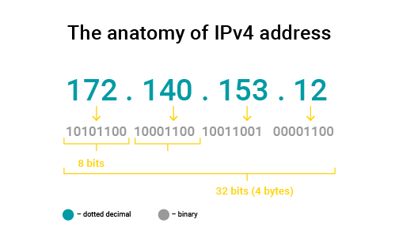

Postingan kali ini dan mungkin beberapa postingan ke depan saya akan membahas fundamental mengenai jaringan komputer, seperti pada postingan ini yang membahas IP atau Internet protocol.

# apa sih yang dimaksud dengan IP versi 4?
IP atau internet protocols merupakan alamat pada suatu perangkat yang terhubung dengan infrastruktur jaringan seperti router dan lain-lain. IP digunakan untuk mengirim ketika komunikasi antar perangkat, karena IP ini seperti alamat dari perangkat agar komunikasi terjalin. IP versi 4 terdiri dari 4 byte atau 32 bit. contoh penulisan IP sendiri seperti berikut
- 192.168.1.1
- 172.0.0.2

penulisan tersebut dengan dotted decimal notation yang terdiri dari 4 oktet, setiap oktet dipisahkan dengan titik. Setiap oktet memiliki batas jumlah yaitu 256 atau dari 0 hingga 255. 

# Alokasi
alokasi merujuk kepada jumlah yang dapat digunakan, ditandai dengan simbol "/" pada akhir penulisan IP address. contoh ketika ada IP seperti berikut, 192.168.1.2/28, karena IPv4 terdiri dari 32 bit jumlah IP yang dapat dialokasikan dengan rumus berikut 2^(32-jumlah prefix) - 2  maka 32-28=4 oleh karena itu 2^4 = 16 IP yang dapat digunakan oleh perangkat, kenapa dikurangi karena akan digunakan oleh broadcast dan network ID.

# Jenis IP
ada dua jenis IP berdasarkan cara mengaksesnya, yaitu IP publik dan IP private.

### IP Publik
IP Publik merupakan ip yang dapat diakses oleh semua orang yang terhubung dengan internet. Ketika kita mengakses suatu website sebenarnya kita mengakses sebuah IP yang ditranslate menjadi name dari suatu URI. IP Publik cenderung untuk membayar untuk mendapatkan IP Publik karena kemampuan IP yang dapat diakses oleh semua orang.

### IP Private 
IP Private merupakan IP yang dalam lingkup jaringan yang berada pada bawah router atau perangkat jaringan dan tidak semua orang dari luar jaringan itu dapat mengaksesnya, contoh dari ip private ketika kita terhubung pada router di rumah yang terdiri dari anggota keluarga masing masing perangkat terhubung dengan router maka itu bisa disebut IP Private dan cenderung gratis untuk digunakan.

# Kelemahan IP 4
kelemahan IP versi 4 memiliki keterbatasan jumlah yang dapat dimiliki. 2^32 adalah jumlah dari total dari IPv4 atau sekitar 4,294,967,296. 

# Referensi
- <https://www.ripe.net/about-us/press-centre/understanding-ip-addressing>
- <https://www.rfc-editor.org/rfc/rfc791>