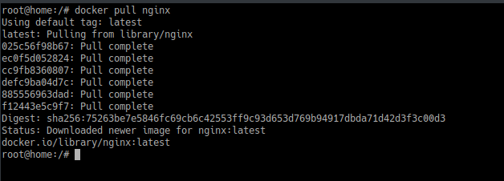
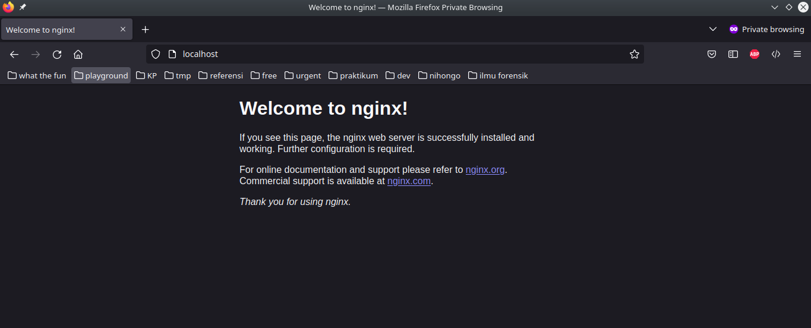
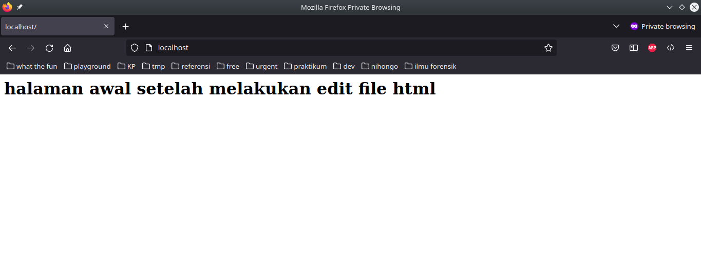

halloo, postingan ini saya akan menjelaskan konfigurasi nginx web server menggunakan docker yang lebih simpel menampilkan index.html.

## Table of content
1. pull images
2. run nginx images
3. check di browser
4. edit index.html
5. stop container


### Pull images
Langkah pertama kita harus pull images dari docker registry atau dalam contoh saya docker pull images dari docker hub.
Untuk melakukan pull dari docker hub menggunakan command
```
docker pull nginx
```

contoh diatas akan secara otomatis pull images nginx dengan versi latest
jika ingin menggunakan versi yang lain seperti alpine atau menggunakan versi yang lain maka command seperti ini
docker pull nginx:<gunakan versi yang ingin digunakan>
```
docker pull nginx:alpine
```



### Run Nginx Images
setelah berhasil melakukan pull images nginx maka selanjutnya menjalankan images dengan command
```
docker run -it -d -p 80:80 --name nginx-webserver nginx
```
-it : menggunakan interpreter terminal
-d : akan menjalankan sebagai background
-p : angka port yang akan di expose oleh docker container
--name : menamai docker container yang akan dijalankan
nginx : nama docker images

*notes
untuk angka port bisa diganti menjadi angka sesuai kita bisa ke 8080:80
80 untuk angka port docker
8080 untuk angka yang dari host access


### Check 
Setelah menjalankan docker maka lihat pada browser


gambar diatas tampilan default docker images

### Edit file html
Apabila kita ingin mengubah tampilan awal nginx maka kita akan mengedit file index.html atau upload ke docker container
pertama stop container karena sebelumnya container masih berjalan di background
lalu buat file index.html

hapus dan run ulang 
docker stop dan docker rm container yang sudah dijalankan





# Reference
- <https://www.docker.com/blog/how-to-use-the-official-nginx-docker-image>