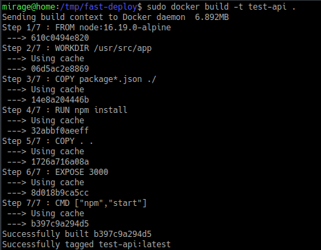
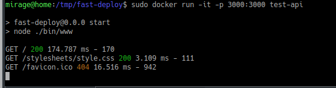

helloo, this article is about how to dockerize node express app in simple way,
first we need to know how to write dockerfile.

first step is need express app to running
then write Dockerfile file

pull docker images for basic images node express, choose the lightweight images with alpine tag
with FROM command is the first command in Dockerfile

WORKDIR is for create directory, this Dockerfile create /usr/src/app  \\
COPY package*.json file to container images \\
after copy the package json then install packages in container \\
with command RUN npm install \\
COPY all \\
EXPOSE means expose port that docker container, if in docker expose port 8080, change it with 8080 to expose that port
```
FROM node:16.19.0-alpine
WORKDIR /usr/src/app

COPY package*.json ./
RUN npm install
COPY . .
EXPOSE 3000
CMD ["npm","start"]
```

after create Dockerfile build it with command 

```bash
docker build -t test-api .
```

-t test-api is your images name with version name \\
. is to reference file Dockerfile 



after build docker images then running docker images \\
docker run -it -p 3000:3000 test-api 



-p means port that host access freely changes to another port to access it
