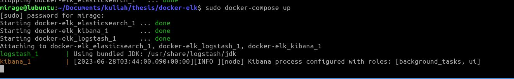
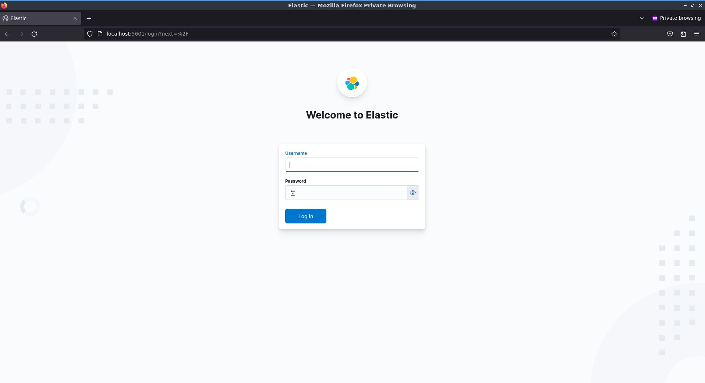
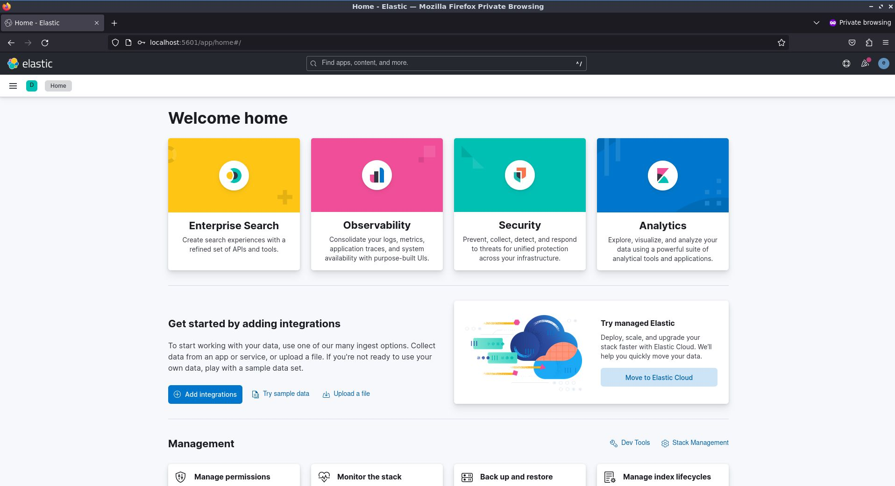

image url: https://sloopstash.com/blog/how-to-get-started-with-elk-stack.html

Server, juga dikenal sebagai peladen, adalah suatu sistem komputer yang memiliki fungsi khusus untuk menyimpan data. Data yang disimpan di server terdiri dari informasi dan berbagai jenis dokumen yang kompleks. Layanan ini ditujukan untuk klien yang membutuhkan informasi untuk pengguna atau pengunjung. Untuk menyediakan layanan akses lebih cepat untuk mengirim atau menerima data dan informasi yang tersedia pada server, server fisiknya terdiri dari jaringan komputer dan terdiri dari banyak komponen pendukung prosesor serta RAM yang berkapasitas besar.

Padahal, seiring dengan waktu, perusahaan Anda harus memiliki visibilitas yang lebih baik, terutama tentang infrastruktur IT. Mengapa memiliki akses ke infrastruktur IT sangat penting? Ini tidak termasuk kemungkinan eror sistem atau serangan orang tidak bertanggung jawab yang dapat merugikan bisnis Anda. Jika Anda memiliki visibilitas yang baik tentang bisnis Anda, peningkatan keamanan juga akan sangat membantu untuk mendeteksi bug atau kesalahan besar yang mungkin terjadi pada infrastruktur IT yang bertanggung jawab atas operasional bisnis Anda. Log management dapat menjadi solusi untuk mendapatkan visibilitas yang lebih baik tentang bisnis Anda. 

Log adalah file yang mencatat tindakan, kejadian, atau aktivitas yang telah terjadi di dalam sistem komputer. Elasticsearch adalah mesin pencari dan analitik yang mudah digunakan. Logstash mengumpulkan data atau log dari berbagai sumber, menyaringnya, memprosesnya, dan mengirimkannya ke masing-masing untuk tujuan tertentu. Meskipun Kibana adalah alat visualisasi data yang dibuat oleh Elasticsearch dan memiliki antarmuka web dasbor yang indah, Kibana dapat digunakan untuk mengelola dan memvisualisasikan data dari Elasticsearch. Namun, hal yang paling penting adalah bahwa Kibana tidak hanya cantik tetapi juga sangat cepat.

Kelebihan ELK stack:
1. skalabilitas: ELK memiliki kemampuan untuk
berkembang.
2. Keandalan: elasticsearch membantu deteksi
kegagalan node dan mendistribusikan data
secara otomatis agar data tetap dapat dinilai dan
diamankan.
3. Otomatis: ELK menyimpan dan mengindeks
JSON secara otomatis
4. Ramah pengguna: ELK memvisualisasikan
semua jenis data sumber yang diindeks ke
elasticsearch.

Tahapan untuk membuat ELK stack yang sangat cepat untuk tahapan belajar bisa dengan membuat ELK stack via docker.

Pertama cloning git repository dari account github yang ada dibawah ini menggunakan command
```bash
git clone https://github.com/deviantony/docker-elk.git
```

setelah itu masuk ke folder repository tersebut
```bash
cd docker-elk
```

lalu setelah masuk ke folder respositoty tersebut lalu masukkan command untuk membuat docker compose up

```bash
docker-compose up
```



atau menambahkan argumen -d agar docker compose berjalan pada background layer
apabila anda tidak memiliki image yang ada pada file docker yml maka proses akan berjalan memakan waktu


ketika anda sudah menjalankan proses docker compose bisa diverifikasi menggunakan docker ps

```bash
docker ps
```

maka anda akan melihat proses docker yang menggunakan stack ELK


untuk membuka tampila browser ELK stack
bisa dengan mengakses localhost:5601




masukkan credential dari username dan password
username: elastic
password: changeme



gambar diatas merupakan tampilan dari tampilan awal elasticsearch.


Mungkin itu dari postingan kali ini, jika ada yang bisa ditanyakan bisa ada di about me :)


References:
- https://www.dicoding.com/blog/apa-itu-server/
- https://inixindojogja.co.id/4-komponen-elk-stack-yang-penting-untuk-kemajuan-bisnismu/