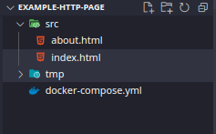
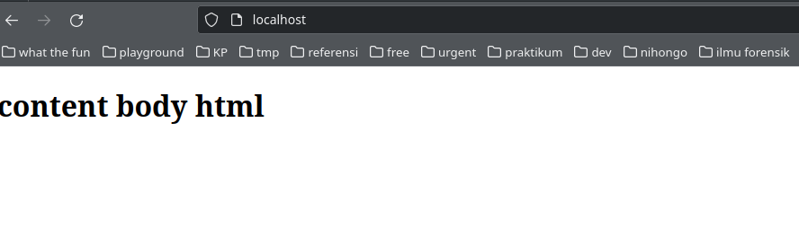

Ini merupakan catatan belajar saya agar tidak lupa dan dapat dibaca kembali pada kemudian hari.
postingan kali ini akan menjelaskan teknologi nginx sebagai webservice yang akan menampilkan halaman index html.

halaman index html sangat sedikit dan cenderung fokus ke bagaimana nginx dapat menjalankan fungsinya sebagai web servicenya.

pertama buat file atau siapkan file statis html yang akan dijalankan menggunakan nginx


kemudian buat file docker compose
```yml
version: '3'
services:
 web:
  image: nginx
  ports:
  - "80:80"
  volumes:
  - ./src:/usr/share/nginx/html/
  - ./tmp:/var/log/nginx/
```
port 80 yang akan dimapping dan diakses oleh user, untuk port ini bisa dapat dirubah sesuai keinginan.

letak folder static html ada di /usr/share/nginx/html.

direktori /src merupakan direktori yang berisi file statis html yang akan digunakan untuk menampilkan halaman.

direktori /var/log/nginx merupakan file logging yang akan digenerate setiap ada user yang mengakses web service yang akan dimapping di folder tmp.


gambar diatas merupakan struktur folder direktori




apabila sudah siap untuk keperluannya hanya tinggal menjalan process docker compose dengan menggunakan command
```bash
sudo docker-compose up
```

bisa ditambahkan dengan argument -d untuk berjalan di background process.


